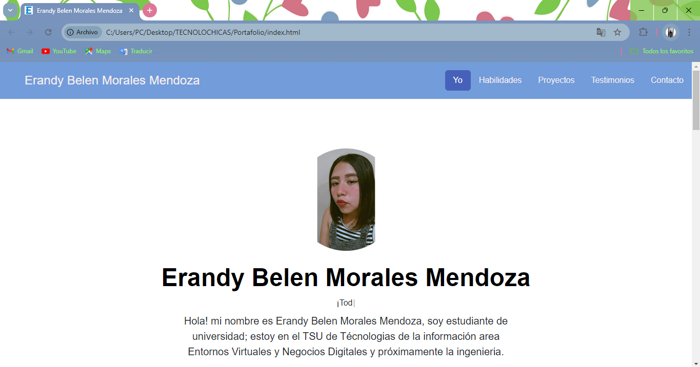

# Portafolio de Erandy Belen 
## Proyecto responsivo realizado con Bootstrap 5

Proyecto creado durante el bootcamp de Tecnolochicas PRO, es adaptable a distintos dispositivos o tamañaos de pantalla.

El propósito de esta pagina web es mostrar mi portafolio de proyectos como desarrolladora web.💜

Podrás encontrarlo aquí[Portafolio]((https://github.com/Erandymm/portafolio))

### Tecnologías
* HTML
* CSS
* Bootstrap 5
* JAVASCRIPT

### El proyecto cuenta con las siguientes secciones:

* Sobre mi
* Habilidades
* Proyectos
* Contacto
### Captura del proyecto

